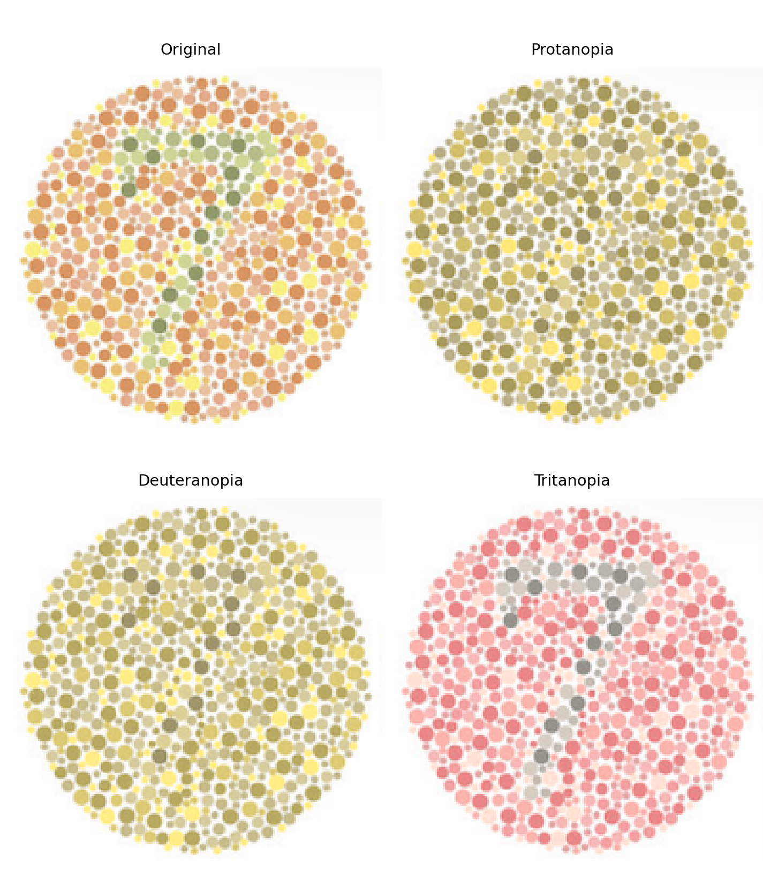

<p align="center">
  
</p>

# Colorblind simulation (CBviz) — Agent Skill

Portable **Agent Skill** that wraps [CBviz](https://github.com/wflynny/cbviz) to simulate how figures appear under color vision deficiency (CVD). Agent-facing instructions: [SKILL.md](SKILL.md).

## Persistent environment

| Item | Value |
|------|-------|
| Cache | `~/.cache/cursor-skills/colorblind-sim/venv/` |
| Spec | [requirements.txt](requirements.txt) |
| Setup | `bash scripts/ensure_env.sh` |
| Rebuild | `bash scripts/ensure_env.sh --force-rebuild` |
| Backend | `python -m venv` (pure-Python) |

First create needs network (pip + GitHub for CBviz). Later runs reuse the cache.

```bash
cd colorblind-sim
bash scripts/ensure_env.sh
bash scripts/ensure_env.sh --print-python
```

## Install for Cursor

Copy or symlink this folder so the client discovers `colorblind-sim/SKILL.md` (e.g. `.cursor/skills/colorblind-sim/` → this directory).

## Example usage

From the skill root (or via absolute paths):

```bash
# Default 2x2 grid (original + protan + deuteran + tritan)
python scripts/run_colorblind_sim.py \
  --input examples/demo.png \
  --outputPrefix /path/to/agentResults/colorblind-sim-RUNID/demo.cb \
  --outputDir /path/to/agentResults/colorblind-sim-RUNID \
  --mode fast \
  --runId RUNID
```

### Example output

The default `fast` mode produces a four-panel comparison of the original figure
with protanopia, deuteranopia, and tritanopia simulations. The example below was
generated at severity 100; select it to view the full-resolution image.

<p align="center">
  <a href="examples/cb7v2.cbviz.png">
    
  </a>
</p>

This output is an accessibility preview rather than a clinical diagnosis. See
[the methods reference](references/methods.md) for simulation details and
limitations.

PDF input (auto-converts page 1 to PNG under `prepared/`):

```bash
python scripts/run_colorblind_sim.py \
  --input figure.pdf \
  --outputPrefix agentResults/colorblind-sim-RUNID/figure.cb \
  --outputDir agentResults/colorblind-sim-RUNID \
  --mode fast \
  --dpi 300
```

Standalone conversion:

```bash
python scripts/convert_to_png.py \
  --input figure.pdf \
  --outputDir agentResults/colorblind-sim-RUNID \
  --dpi 300
```

SVG/EPS require host **`rsvg-convert`** or **`inkscape`** on `PATH`.

## Layout

| Path | Role |
|------|------|
| [SKILL.md](SKILL.md) | Agent workflow |
| [scripts/run_colorblind_sim.py](scripts/run_colorblind_sim.py) | Main CLI |
| [scripts/convert_to_png.py](scripts/convert_to_png.py) | Format helpers |
| [scripts/ensure_env.sh](scripts/ensure_env.sh) | Persistent venv |
| [references/](references/) | Formats, methods, citations |
| [examples/demo.png](examples/demo.png) | Smoke-test figure |
| [examples/cb7v2.cbviz.png](examples/cb7v2.cbviz.png) | Example four-panel CVD simulation |
| [tests/](tests/) | Pytest suite |

## Testing

```bash
bash scripts/ensure_env.sh
COLORBLIND_SIM_SKIP_ENV_BOOTSTRAP=1 \
  "$(bash scripts/ensure_env.sh --print-python)" -m pytest tests/ -q
```

## Citation

See [references/citations.md](references/citations.md). Credit **CBviz** / **colorspacious** for the method and the CAB-aiSkills skill packager for the workflow separately.

## License

Skill packaging: [CC BY-NC-SA 4.0](../LICENSE.txt). Upstream CBviz retains its own license (see the [CBviz repository](https://github.com/wflynny/cbviz)).
