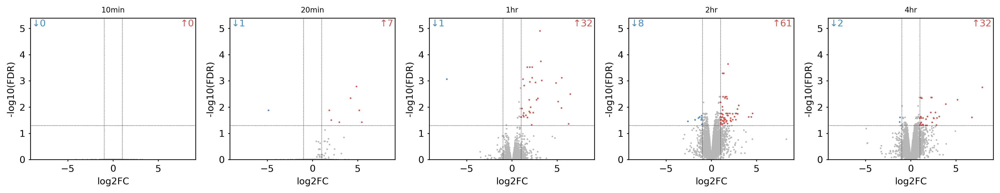
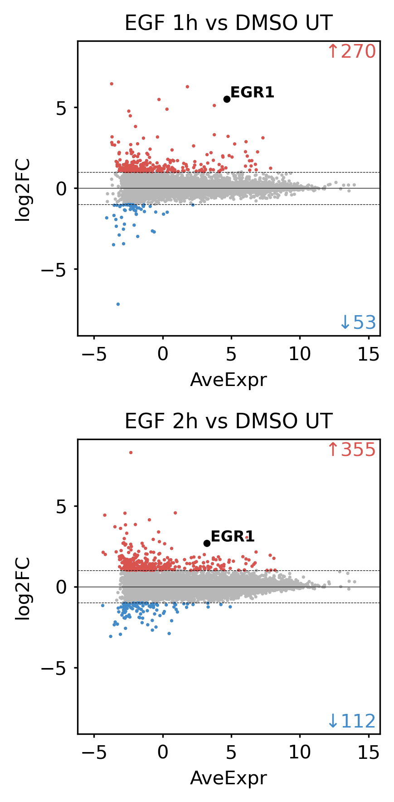

<p align="center">
  
</p>

# Volcano Grid Plot — Agent Skill

Portable **Agent Skill** for **publication-ready Volcano and MA plot grids** from differential gene-expression or differential binding tables (RNA-seq, ChIP-seq, ATAC-seq, Cut&Run, multi-omics). Agent-facing instructions are in [SKILL.md](SKILL.md).

Bundled example data: **GSE202762** EGF timecourse RNA-seq (`examples/GSE202762.*.regulation.tsv`).

## Environment

- **Python** 3.9 or newer
- **Dependencies:**

```bash
cd volcano-grid-plot
pip install -r requirements.txt
```

## Install for Cursor or other agent clients

- **Project skill:** Copy or symlink this folder so the client discovers a directory named `volcano-grid-plot` containing `SKILL.md` (for example `.cursor/skills/volcano-grid-plot/`).
- **Invoke** by skill name `volcano-grid-plot` or by asking for volcano/MA plot grids from differential tables.

## Example outputs

### Timecourse in natural order (10min → 4hr)

Single-row volcano grid; panel titles follow treatment time (`sampleLabel` in the manifest). Shared axes across all contrasts.

**Prompt:** *Plot a volcano grid for all GSE202762 EGF timepoints in natural chronological order (10min, 20min, 1hr, 2hr, 4hr).*



Manifest: [examples/gse202762_timecourse_manifest.tsv](examples/gse202762_timecourse_manifest.tsv)

```bash
python scripts/volcano_ma_grid.py examples/gse202762_timecourse_manifest.tsv out/timecourse \
  --plotsToPlot volcano \
  --fcCol log2FC --sigCol FDR --nameCol geneSymbol \
  --rows 1
```

### Custom panel titles and EGR1 highlight — MA plot (1h & 2h)

MA grid only (one column × two rows); `sampleLabel` sets readable contrast titles; **EGR1** labeled on each panel.

**Prompt:** *MA grid for GSE202762 1h and 2h with clear contrast titles; highlight EGR1.*



Manifest: [examples/gse202762_1hr_2hr_titles_EGR1_manifest.tsv](examples/gse202762_1hr_2hr_titles_EGR1_manifest.tsv)

```bash
python scripts/volcano_ma_grid.py examples/gse202762_1hr_2hr_titles_EGR1_manifest.tsv out/EGR1_demo \
  --plotsToPlot ma \
  --fcCol log2FC --sigCol FDR --nameCol geneSymbol --aveExprCol AveExpr \
  --cols 1 --rows 2 \
  --labelPoints EGR1
```

## Quick start

Run from **this directory** (`volcano-grid-plot`). See [Example outputs](#example-outputs) for full manifests and figures.

## How the agent uses this skill

1. Read [SKILL.md](SKILL.md) and inspect **headers** of all input tables.
2. Map columns per [references/column-identification.md](references/column-identification.md).
3. Harmonize column names across files if needed; write `column_renames.tsv`.
4. Build manifest TSV and run [scripts/volcano_ma_grid.py](scripts/volcano_ma_grid.py).
5. Deliver PNG/PDF under `agentResults/volcano-grid-plot-<runId>/`.

## Layout

| Path | Role |
|------|------|
| [assets/](assets/) | Skill badge SVG |
| [SKILL.md](SKILL.md) | Agent workflow, safety, outputs |
| [scripts/volcano_ma_grid.py](scripts/volcano_ma_grid.py) | Plotting CLI |
| [references/column-identification.md](references/column-identification.md) | Column auto-detection and harmonization rules |
| [references/input-manifest-and-layout.md](references/input-manifest-and-layout.md) | Manifest format and grid flags |
| [examples/](examples/) | GSE202762 DEG tables, manifests, [figures/](examples/figures/) |
| [tests/](tests/) | Smoke tests |

## Outputs

| File pattern | Description |
|--------------|-------------|
| `<prefix>.volcanoGrid.png`, `.pdf` | Volcano grid (300 DPI + vector) |
| `<prefix>.MAgrid.png`, `.pdf` | MA grid |
| `<prefix>.*.gmt`, `*.gmt.txt` | Per-panel up/down gene sets |
| `volcano_ma_grid.log` | Run log |

## User-facing prompt examples

Example prompts a user might type and how the agent should interpret them. See [examples/evaluation-prompts.md](examples/evaluation-prompts.md) for detailed expected behavior.

| User prompt | Interpretation |
|---|---|
| "Plot GSE202762 EGF timepoints in natural order as one volcano row" | Manifest 10min→4hr; `gse202762_timecourse_manifest.tsv`; `--rows 1`; short `sampleLabel` titles |
| "MA grid for 1h and 2h with clear titles; highlight EGR1" | `gse202762_1hr_2hr_titles_EGR1_manifest.tsv`; `--plotsToPlot ma --cols 1 --rows 2 --labelPoints EGR1` |
| "Make a volcano grid with two columns and one row from these regulation tables" | Build manifest; `--plotsToPlot volcano --cols 2 --rows 1`; detect `log2FC`, `FDR`, `geneSymbol` |
| "Volcano grid for all my *regulation.tsv DEG files in this folder" | Inventory contrasts → user-ordered manifest → auto-detect columns → run grid |
| "Compare many RNA-seq contrasts in a large volcano/MA grid" | Large manifest; set `--cols` / `--rows`; shared axes; explicit column flags |
| "Highlight FXN on every panel of my DEG volcano grid" | `--labelPoints FXN`; `--nameCol geneSymbol` (or detected gene column) |
| "ChIP-seq volcano grid; label peak chr22:39959548-39959726" | `--nameCol Region`; `--labelPoints` = exact region ID string |
| "Label TP53 on my ATAC peak differential table" | `--identifyRegionByGeneName Yes` with `Gene_2kb` (or equivalent); else ask user |
| "Volcano only, no MA — we don't have average expression" | `--plotsToPlot volcano` or `--aveExprCol ignore` |
| "These DESeq files have different column names — still one grid" | Harmonize headers → `column_renames.tsv` + prepared copies |
| "Correlate two RNA-seq files with KDE scatter" | Out of scope; use `kde-correlation-scatter` |

## Testing

```bash
python scripts/volcano_ma_grid.py --help
python -m pytest tests/
```

## License

Packaging and skill text: **Apache-2.0** (see [SKILL.md](SKILL.md) frontmatter).
